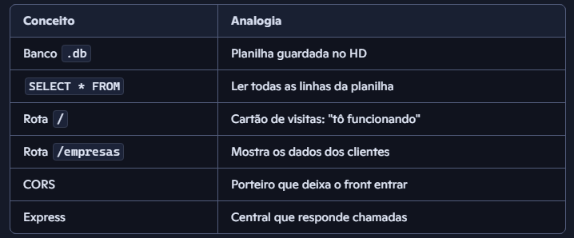

# 🚀 EcoLog PME - Back-End com Node.js + SQLite

Bem-vindo à cartilha oficial do back-end do EcoLog PME!  
Aqui você vai entender **cada linha do código** que alimenta os dados no seu servidor, usando:

- Node.js
- Express
- SQLite
- CORS

---

## 📦 Instalações necessárias

Antes de tudo, no terminal dentro da pasta `back-end`, rode:

```bash
npm init -y
npm install express sqlite3 cors
```
## Explicação:

* npm init -y: Cria o package.json, documento que guarda as dependências do projeto.

* express: Framework web que permite criar rotas HTTP.

* sqlite3: Biblioteca que conecta ao banco de dados .db (SQLite).

* cors: Libera o acesso ao seu servidor vindo de outras origens (front-end).

## 🔧 Arquivo: back-end.js
Esse é o coração do back-end. Linha por linha explicada abaixo 👇
1. Importação dos módulos js
```
const express = require('express'); // Cria e gerencia o servidor
const cors = require('cors'); // Libera acessos externos (como do front-end)
const sqlite3 = require('sqlite3').verbose(); // Biblioteca do SQLite com logs mais verbosos
```
2. Inicializa o servidor
```
const app = express(); // Cria a aplicação Express
app.use(cors()); // Ativa o CORS para evitar bloqueio do navegador
```
3. Conecta ao banco de dados
```
const db = new sqlite3.Database('./banco-dados/logistica-db.db', (err) => {
  if (err) {
    console.error('Erro ao conectar ao SQLite:', err);
  } else {
    console.log('Conectado ao banco SQLite!');
  }
});

Explicação:
O caminho './banco-dados/logistica-db.db' deve bater com onde o arquivo .db está.
Se tudo der certo, aparece Conectado ao banco SQLite! no terminal.
```
4. Rota de teste (/)
```
app.get('/', (req, res) => {
  res.send('Servidor com SQLite funcionando!');
});

Explicação:
Abre o navegador e acessa http://localhost:3001/ pra ver se o servidor tá respondendo.
```
5. Rota de dados (/empresas)
```
app.get('/empresas', (req, res) => {
  db.all('SELECT * FROM empresas', [], (err, rows) => {
    if (err) {
      console.error('Erro na consulta:', err);
      res.status(500).send('Erro ao buscar empresas');
    } else {
      res.json(rows);
    }
  });
});

Explicação:
Essa rota lê os dados da tabela empresas no seu banco .db.
Se tudo estiver ok, acessando http://localhost:3001/empresas vai mostrar os dados em JSON.
```
6. Inicializa o servidor
```
app.listen(3001, () => {
  console.log('Servidor rodando na porta 3001');
});

Explicação:
Coloca o servidor pra escutar requisições na porta 3001.
É por isso que o front acessa com localhost:3001/....
```

## 🧠 Analogias para fixar


## ✅ Checklist de funcionamento
[ ] Instalou as libs certinho com npm install
[ ] Conectou ao banco .db com caminho correto
[ ] Rodou com node back-end.js
[ ] Recebeu "Conectado ao banco SQLite!" no terminal
[ ] Testou rota / e recebeu texto
[ ] Testou rota /empresas e recebeu JSON

## 📎 Dica extra
Se quiser que o servidor atualize sozinho quando fizer mudanças no código, instala o nodemon:
```
npm install -D nodemon
```
E roda com:
```
npx nodemon back-end.js

```

## 🔮 Próximos passos
* Criar rota de login/autenticação
* Criar rota para cadastro de novas empresas
* Integrar com o front-end (Next.js)